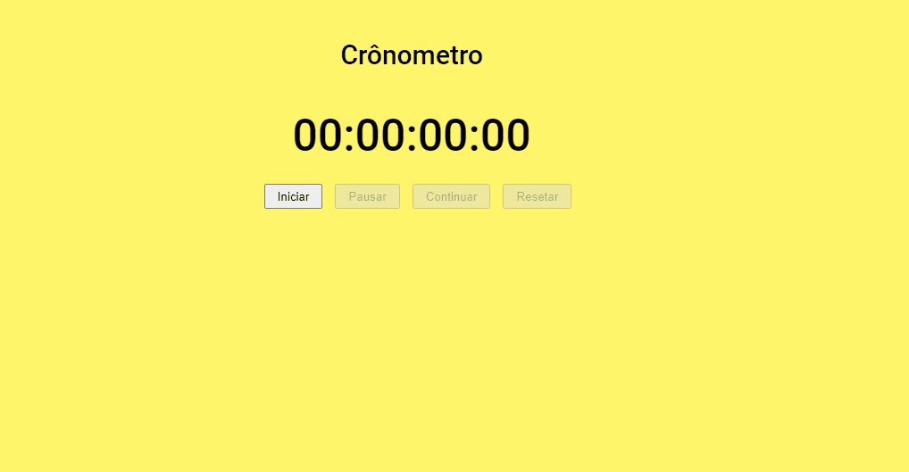

# Projeto Crônometro (Iniciante)

<h1>
    
</h1>

## Sobre

Projeto criado em JavaScript para colocar em prática conhecimentos sobre JavaScript.

## Tecnologias utilizadas

- HTML
- CSS
- JavaScript

---
Desenvolvido por Gustavo Giannini